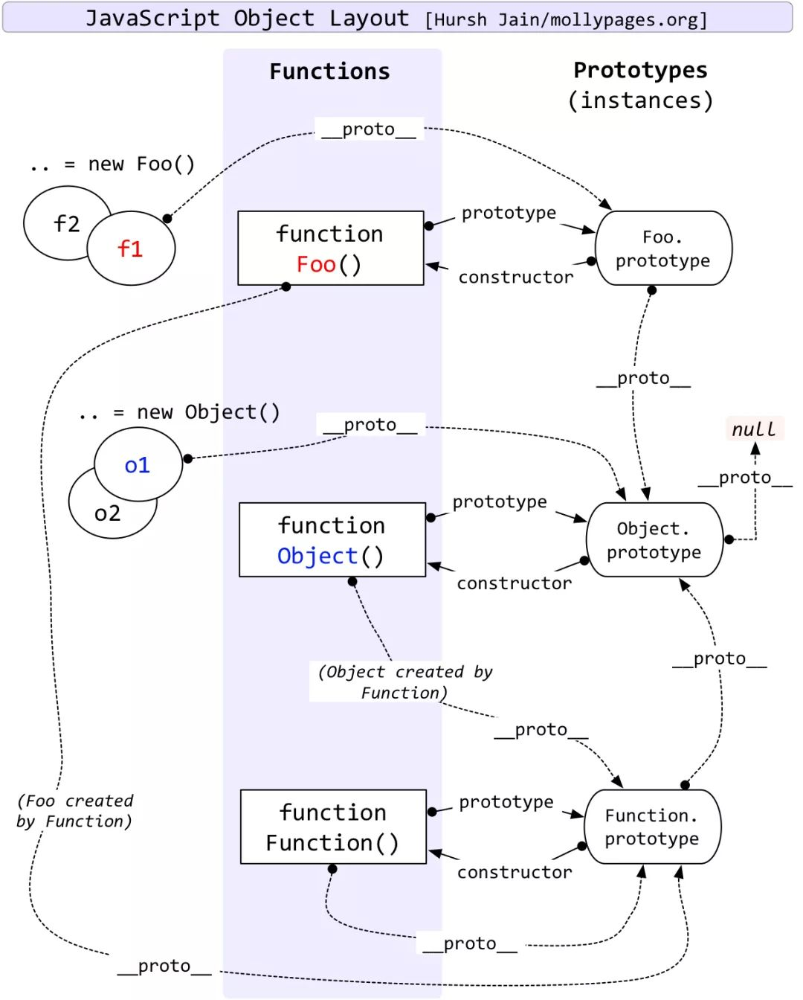

# 原型和原型链

## 1. 原型

每个JS对象一定对应一个原型对象，并从原型对象继承属性和方法

### 1.1 `__proto__`

**对象**的`__proto__`属性值就是对象的原型对象

此属性是过时的语法，现在建议使用Object.getPrototypeof(obj)

函数也是对象，因此也有`__proto__`属性

### 1.2 `Prototype`

**函数**的prototype属性值就是函数的原型对象

定义：给其他对象提供共享属性的对象，prototype 本身也是对象，只是被用以承担某个职能

当说 prototype 对象时，实际上说的是 “xxx 函数对象的 prototype 对象”

### 1.3 `constructor`

每个原型都有一个 constructor 属性指向关联的构造函数

实例访问 constructor 属性是获取的原型对象的构造函数

```js
function Person(age) {
    this.age = age;
}
let p = new Person(50);
console.log(Person.prototype.constructor === Person); // true
console.log(p.constructor === Person); // true 会查找原型对象
```

对于引用类型来说 `constructor` 属性值是可以修改的，但是对于基本类型来说是只读的,因为创建他们的是只读的原生构造函数（`native constructors`）


## 2. 原型链

每个对象拥有一个原型对象，通过 `__proto__` 指针指向上一个原型 ，并从中继承方法和属性，同时原型对象也可能拥有原型，这样一层一层，最终指向 `null`。这种关系被称为**原型链 (prototype chain)**，通过原型链一个对象会拥有定义在其他对象中的属性和方法。

因此，当读取实例的属性时，如果找不到，就会查找与对象关联的原型中的属性，如果还查不到，就去找原型的原型，一直找到最顶层为止。

### 原型链知识点

- 原型链的尽头（root）是`Object.prototype`。**所有对象(除null)均从`Object.prototype`继承属性**
- `Object.prototype.__proto__`值是null，原型链终止

- `Function.prototype`和`Function.__proto__`为同一对象

  意味着： `Object`/`Array`/`String`等等构造函数本质上和`Function`一样，均继承于`Function.prototype`

- `Function.prototype`直接继承root（`Object.prototype`）

-  继承的原型链：`Object.prototype(root)`<---`Function.prototype`<---`Function|Object|Array...`

- 对象的`__proto__`指向自己构造函数的`prototype`

- ES规范定义对象字面量（{}）的原型就是`Object.prototype`

  

### `Object`和`Function`的鸡和蛋的问题

- `Function.prototype`是个不同于一般函数（对象）的函数（对象）
  - `Function.prototype`像普通函数一样可以调用，但总是返回`undefined`。
  - 普通函数实际上是`Function`的实例，即普通函数继承于`Function.prototype`。`func.__proto__ === Function.prototype`。
  - `Function.prototype`继承于`Object.prototype`，并且没有`prototype`这个属性。`func.prototype`是普通对象，`Function.prototype.prototype`是`null`。
  - **总结**，`Function.prototype`其实是个另类的函数，可以独立于/先于`Function`产生。
- Object本身是个（构造）函数，是Function的实例，即`Object.__proto__`就是`Function.prototype`

**问题总结：**

先有Object.prototype（原型链顶端），Function.prototype继承Object.prototype而产生，最后，Function和Object和其它构造函数继承Function.prototype而产生

### 原型链图解

#### 原型和原型链经典关系图




#### 自己画的原型图

**图解描述：**

Person、Object、Function是函数对象，具备prototype属性，其他对象是只有__proro__

获取原型对象

Person.__proto__、Object.__proto__与Function.__proto__相等，是ƒ () { [native code] }

Person.__proto__、Object.__proto__与Function.__proto__的原型对象为Object.prototype

Function.__proto__和Function.prototype值相等，为空函数： ƒ () { [native code] }

Person.constructor、Object.constructor与Function值相等，为： ƒ Function() { [native code] } 


#### 原型链代码输出结果

```js
function Person(name) {
    this.name = name
}
var p2 = new Person('king');
console.log(p2.__proto__) //Person.prototype
console.log(p2.__proto__.__proto__) //Object.prototype
console.log(p2.__proto__.__proto__.__proto__) // null
console.log(p2.__proto__.__proto__.__proto__.__proto__)
//null后面没有了，报错
console.log(p2.__proto__.__proto__.__proto__.__proto__.__proto__)
//null后面没有了，报错
console.log(p2.constructor)//Person
console.log(p2.prototype)//undefined p2是实例，没有prototype属性

console.log(Person.constructor)//Function 一个空函数
console.log(Person.prototype)
//打印出Person.prototype这个对象里所有的方法和属性
console.log(Person.prototype.constructor)//Person
console.log(Person.prototype.__proto__)// Object.prototype
console.log(Person.__proto__) //Function.prototype
console.log(Function.prototype.__proto__)//Object.prototype
console.log(Function.__proto__)//Function.prototype
console.log(Object.__proto__)//Function.prototype
console.log(Object.prototype.__proto__)//null

console.log(Function); // ƒ Function() { [native code] }  空函数，名为Function
console.log(Object.constructor); // ƒ Function() { [native code] } 
console.log(Person.constructor); // ƒ Function() { [native code] } 
console.log(Function === Object.constructor); // true
console.log(Function === Person.constructor); // true

console.log(Function.__proto__); // ƒ () { [native code] }
console.log(Function.prototype); // ƒ () { [native code] }
console.log(Function.__proto__ == Function.prototype); // true
console.log(Function.__proto__.__proto__ === Object.prototype) // true
console.log(Function.prototype.__proto__ === Object.prototype) // true

```


## 3. 参考资源

- [从__proto__和prototype来深入理解JS对象和原型链](https://github.com/creeperyang/blog/issues/9)
- [JavaScript深入之从原型到原型链](https://github.com/mqyqingfeng/Blog/issues/2)

