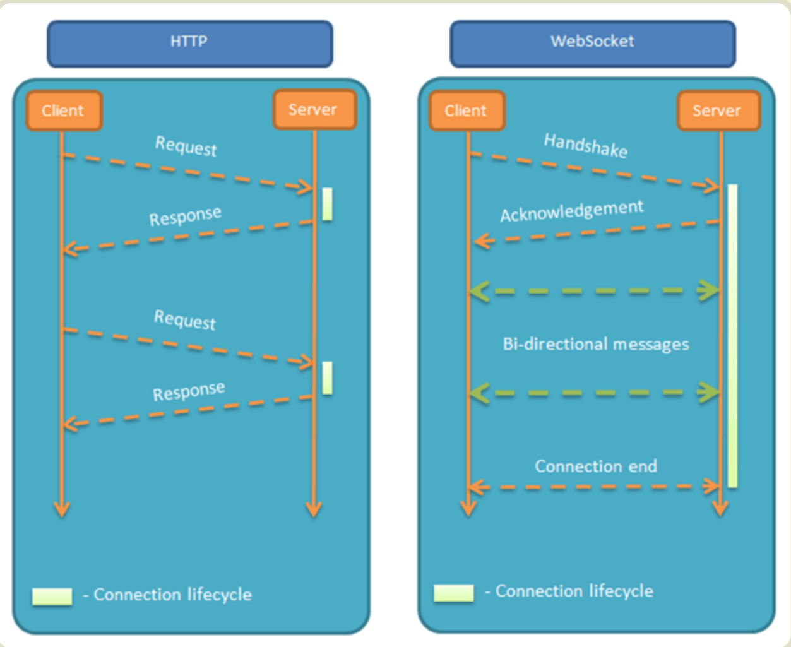

# WebSocket

[TOC]


# 1. 概述

WebSocket是一种网络通信协议。

# 2. 为什么需要WebSocket?

 HTTP协议存在一个缺陷：通信只能由客户端发起

也就是说，只能通过客户端发起请求，服务器返回结果。不能由服务器主动向客户端发送消息

如果依旧使用HTTP协议，当服务器有持续的状态更新时，只能使用“轮询”，每隔一段时间发送请求询问，是否有新的信息

**轮询：**效率低，且浪费资源（需不停建立连接，或HTTP连接始终打开）

# 3. WebSocket能做什么？

服务器可以主动向客户端推送信息，客户端也可以主动向服务器发送信息，是真正的双向平等对话

**适用场景：**

导出数据很慢，通过服务器发送，客户端接收数据之后，不断显示（相当于是导出使用进度条不断更新数据）

即时聊天通信、多玩家游戏、在线协同编辑/编辑、体育/游戏实况、实时地图位置

# 4. WebSocket的特点和连接过程

## 4.1 WebSocket的特点

（1）建立在 TCP 协议之上，服务器端的实现比较容易。

（2）与 HTTP 协议有着良好的兼容性。默认端口也是80和443，并且握手阶段采用 HTTP 协议，因此握手时不容易屏蔽，能通过各种 HTTP 代理服务器。

（3）数据格式比较轻量，性能开销小，通信高效。

（4）可以发送文本，也可以发送二进制数据。

（5）没有同源限制，客户端可以与任意服务器通信。

（6）协议标识符是ws（如果加密，则为wss），服务器网址就是 URL。

## 4.2 WebSocket的连接过程

客户端发起http请求，经过3次握手后，建立起TCP连接；http请求里存放WebSocket支持的版本号等信息，如：Upgrade、Connection、WebSocket-Version等；
然后，服务器收到客户端的握手请求后，同样采用HTTP协议回馈数据；
最后，客户端收到连接成功的消息后，开始借助于TCP传输信道进行全双工通信

# 5. WebSocket和HTTP的比较

**相同点：**

WebSocket和HTTP都是基于TCP的，都是可靠传输协议，都是应用层协议

**联系：**

WebSocket在握手时，数据是通过HTTP传输的，在建立之后，真正传输是不需要HTTP协议的

**不同：**

HTTP是单向的，而WebSocket是双向的




# 6. WebSocket的基本使用

## 6.1 WebSocket 构造函数

可以通过WebSocket对象构造函数可以创建WebSocket实例

```javascript
var webSocket = new WebSocket('ws://localhost:8080');
```

执行此语句之后，客户端会与服务器进行连接

## 6.2 webSocket.readyState

readyState属性返回实例对象的当前状态，共有四种。

CONNECTING：值为0，表示正在连接。
OPEN：值为1，表示连接成功，可以通信了。
CLOSING：值为2，表示连接正在关闭。
CLOSED：值为3，表示连接已经关闭，或者打开连接失败。

## 6.3 webSocket.onopen

实例对象的onopen属性，用于指定连接成功后的回调函数

## 6.4 webSocket.onclose

实例对象的onclose属性，用于指定连接关闭后的回调函数

## 6.5 webSocket.onmessage

实例对象的onmessage属性，用于指定收到服务器数据后的回调函数

这里可以后端返回某个字段，代表没有数据了，使用onclose函数，断开连接

## 6.6 webSocket.send()

实例对象的send()方法用于向服务器发送数据

## 6.7 webSocket.onerror

实例对象的onerror属性，用于指定报错时的回调函数


# 7. 总结

websocket是一个网络通信协议，主要解决客户端和服务器平等对话的问题，主要通过new WebSocket(url)创建一个WebSocket实例，构造函数的参数是服务端地址，当实例创建之后，客户端就能和服务器端进行对话，通过onopen函数，在建立连接之后，发送网络请求，通过onmessage接收返回的信息，在返回信息里，可发送停止通信的标志，如果停止通信，则调用onclose函数关闭连接。如果连接中发生错误，则使用onerror函数进行错误的处理


# 参考资源

[阮一峰老师WebSocket文章](https://www.ruanyifeng.com/blog/2017/05/websocket.html)